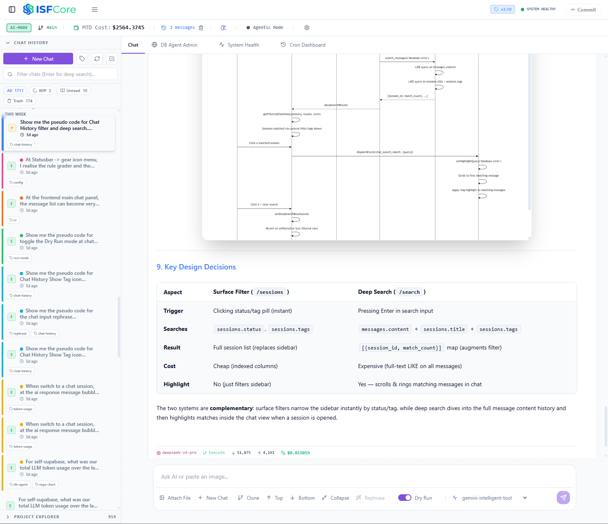
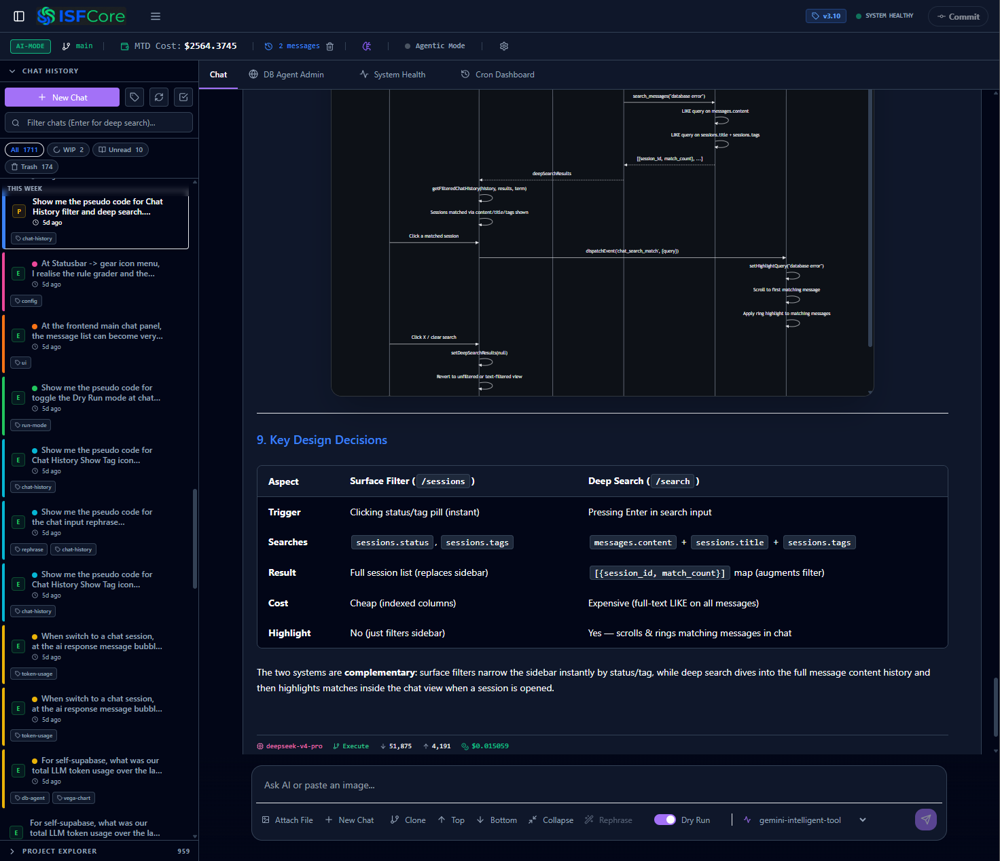
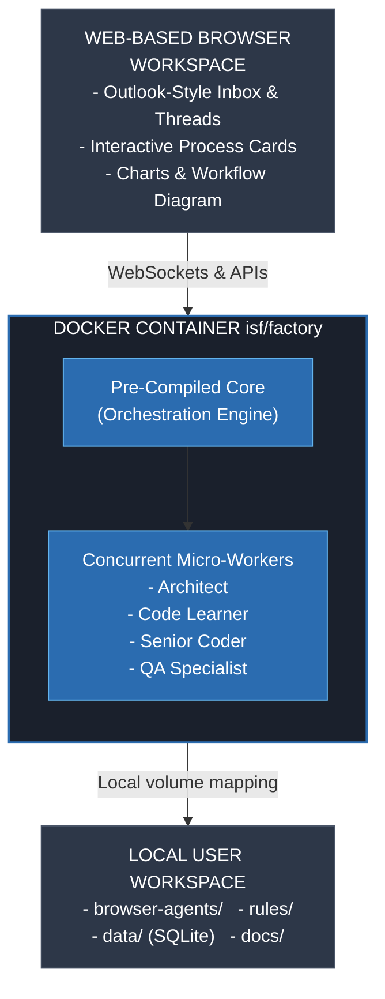
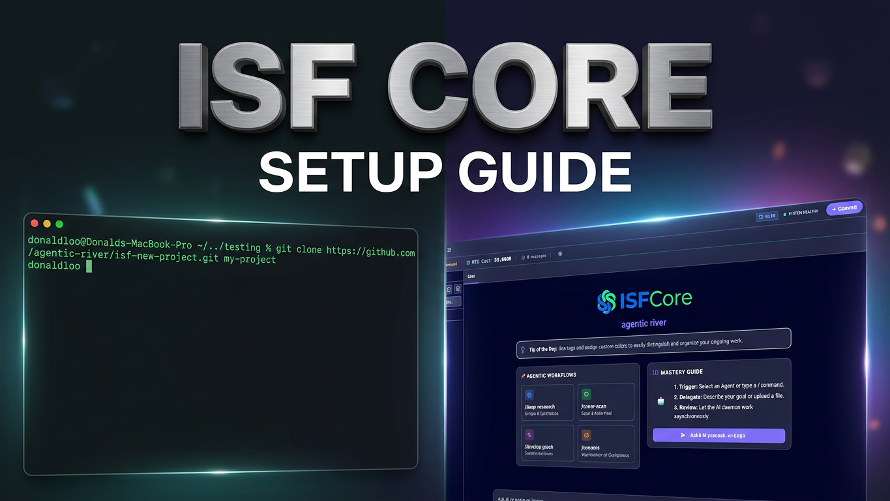

# 🤖 ISF-Core — Infinite Software Factory

<p align="center">
  <strong>The Free, Self-Hosted AI App Factory.</strong><br>
  🚀 Coordinate a concurrent team of specialized AI workers.<br>
  💬 Unified "Inbox-style" workspace.<br>
  🔒 Built for maximum token efficiency and 100% data privacy.
</p>

<p align="center">
  <a href="https://github.com/agentic-river/isf-core/stargazers"></a>
  <a href="https://github.com/sponsors/agentic-river"></a>
  <a href="https://github.com/agentic-river/isf-core/issues"></a>
</p>

<!-- <p align="center">
  <em></em>
</p> -->

<p align="center">
  <a href="#-quick-start"><strong>🚀 Jump to Quick Start</strong></a> | 
  <a href="#-cloned-workspace-architecture"><strong>📖 Read the Docs</strong></a>
</p>

Welcome to your standalone deployment of **ISF-Core**, the engine behind the **Infinite Software Factory (ISF)**. ISF-Core is a free, self-hosted, local-first AI development platform that transforms you from a _writer of code_ into an _Orchestrator of AI Departments_.

Unlike traditional terminal-bound CLI tools or editor-integrated extensions that force you into a single-threaded bottleneck, ISF-Core lets you act as the **Engineering Manager**, orchestrating specialized, concurrent AI workers via an Outlook-style, multi-threaded Web UI dashboard.

<p align="center">
  
  
  <br/>
  <em>Seamlessly switch between Light and Dark themes to suit your workspace preference.</em>
</p>

---

## 📟 The Competitive Landscape: Terminal CLI vs. Web GUI

To understand why ISF-Core represents a major evolution in AI-driven development, let's examine how it stacks up against standard market tools:

| Feature / Metric         | 📟 Terminal CLI Agents                                                             | 💻 Editor-Bound Chat                                                 | 🌐 ISF-Core (Multi-Agent Factory)                                               |
| :----------------------- | :--------------------------------------------------------------------------------- | :------------------------------------------------------------------- | :------------------------------------------------------------------------------ |
| **Interface Mode**       | 🟡 **Terminal CLI** (Highly efficient for power users, but terminal-bound)         | 🟡 **IDE-Bound GUI** (Excellent inline code editing)                 | 🟢 **Web-Based Workspace UI** (Outlook-style Dashboard)                         |
| **User Experience (UX)** | 🟡 Blazing fast, but tracking massive multi-file architectural changes is complex. | 🟢 Familiar IDE environment with seamless contextual sidebars.       | 🟢 **Inbox Dashboard** with visual thread-switching, charts & task tracking.    |
| **Concurrency**          | 🟡 **Sequential.** Single active process; you wait for the agent to finish tasks.  | 🟡 **Sequential.** Focused on one active chat/inline task at a time. | 🟢 **Concurrent.** Spin up multiple independent AI threads simultaneously.      |
| **Token Efficiency**     | 🟢 **Excellent.** Uses advanced repo mapping to minimize context payload.          | 🟡 **Good.** But context windows can bloat with many open file tabs. | 🟢 **Ultra-High.** Local AST maps and semantic federated databases cache logic. |
| **Self-Healing Loop**    | 🟢 **Very Strong.** Can run shell tests and self-correct syntax autonomously.      | 🟡 **Moderate.** Requires user to manually click "fix" or run tests. | 🟢 **Fully Autonomous.** Executes tests/linters inside isolated Docker engines. |
| **Hosting & Privacy**    | 🟡 Code is local, but telemetry/API privacy depends strictly on the vendor.        | 🟡 Cloud-synced telemetry and proprietary backend dependencies.      | 🟢 **100% Private, Self-Hosted Docker.** Your keys, your code. Air-gap capable. |

---

## ⚡ The ISF-Core Paradigm: You are the Engineering Manager

```
                         ┌─────────────────────────┐
                         │   YOU: Eng. Manager     │
                         └───────────┬─────────────┘
                                     │ (Coordinates & Approves)
                                     ▼
         ┌───────────────────────────┴───────────────────────────┐
         │              ISF-CORE INBOX WORKSPACE                 │
         │   (Parallel, Threaded Communication & Output)         │
         └───────┬───────────────────┬───────────────────┬───────┘
                 │                   │                   │
                 ▼                   ▼                   ▼
        ┌─────────────────┐ ┌─────────────────┐ ┌─────────────────┐
        │    Architect    │ │  Code Learner   │ │  Senior Coder   │
        │ (Design Spec)   │ │ (Reads Legacy)  │ │ (Writes Code)   │
        └─────────────────┘ └─────────────────┘ └─────────────────┘
```

- **Manager-Worker Paradigm:** You do not spend hours writing exhaustive, perfect prompts. You delegate high-level requirements. Your specialized AI workers collaborate in parallel, presenting clear options and design proposals for your approval.
- **Concurrent Multi-Agent Execution:** Need to refactor a backend API while drafting a frontend view? Spin up parallel workers. While Agent A reads and maps legacy files, Agent B outlines the API schema, and Agent C designs frontend components concurrently.
- **Outlook-Style Multi-Threaded Workspace:** Interact with your team through an elegant web-based messaging hub. Monitor progress, review code proposals, adjust workflows, and make high-level decisions across parallel tasks without context switching or terminal freezing.

---

## 🧠 Core Differentiators & Breakthrough Capabilities

### 1. 🌐 Local-First Web Dashboard + Any IDE

Unlike IDE-bound extensions or sequential terminal CLIs, ISF-Core is a **full-featured Web Workspace** (`http://localhost:3006`) seamlessly mapped to your local IDE.

- 🔄 <span style="color:#2b6cb0;">**Zero-Sync Filesystem:**</span> Edits sync instantly with VS Code/IntelliJ. **No copy-paste.**
- 📂 <span style="color:#2b6cb0;">**Built-in Code Editor:**</span> Git-aware file tree. Edit and save directly in the browser.
- 💬 <span style="color:#2b6cb0;">**Outlook-Style Inbox:**</span> Run concurrent AI threads independently.
- 📊 <span style="color:#2b6cb0;">**Visual Thinking Process:**</span> Live, color-coded task tracing (reasoning 🟣, progress 🟡, success 🟢).
- 👁️ <span style="color:#2b6cb0;">**Dry Run Mode:**</span> `Shift + Tab` for code review before disk write.
- ⚡ <span style="color:#2b6cb0;">**Runtime Model Switching:**</span> Swap LLMs instantly while chatting.

> 💡 **The result:** Your IDE and AI agent share one filesystem. **Plan in Web UI ➡️ Review in VS Code. Full data sovereignty.**
>
> 👉 **[View the Full Platform Web UI Showcase (21 Screenshots)](options_setup/webui_workspace_overview.md)**

### 2. 📉 Radical Token Efficiency (Zero Context Bloat)

Eliminates massive, blind file dumps. ISF-Core uses Git-aware file discovery and precise line-range slicing to send only what's needed.

- 💸 <span style="color:#38a169;">**Never Get Surprised by Bills:**</span> `/usage` dashboard visually graphs exact micro-costs.
- 🔍 <span style="color:#38a169;">**Per-Prompt Observability:**</span> Usage bars on every message show hit/miss metrics and token counts.
- 🚦 <span style="color:#38a169;">**Smart Model Routing:**</span> Define roles in `models.yaml`. Route heavy architectural tasks to expensive models and basic cron tasks to cheap/fast models automatically.

### 3. 🚀 Choice of Leading-Edge LLM Powerhouses

Native support for **8 LLM providers (40+ models)**. Swap dynamically per task!

- 🔵 **Google Gemini:** 2M context, deep visual inspection (Playwright snapshots).
- 🟣 **Anthropic Claude:** Top-tier reasoning (Opus/Sonnet/Haiku).
- ⚪ **DeepSeek V4:** Pro & Flash for precise logical deduction at low cost.
- 🟢 **OpenAI:** GPT-4 models.
- 🟠 **Alibaba Qwen:** High-performance Qwen3.7/GLM-5.1.
- 🟡 **Kimi (Moonshot):** 256K context chain-of-thought code reasoning.
- 🔷 **Z.AI GLM-5.2:** 1M context, 128K max output, thinking mode, strong coding (81.0 Terminal-Bench).
- 🔴 **Ollama (Local):** Air-gapped, zero-cost local execution (e.g., Gemma 4 26B).

### 4. 🧠 Self-Reflection & Auto-Optimizing Rules

**Meta-Learning Self-Reflexivity:** ISF-Core doesn't repeat mistakes.

- 🛑 **Post-Mortem Analysis:** Diagnoses root causes of test or build errors.
- 📝 **Rule Generation:** Automatically writes markdown rules into `rules/`.
- 🔄 **Continuous Adaptation:** Permanently adapts to your codebase constraints.

### 5. 📚 Living, Continuous Documentation

Treats documentation as a first-class citizen to combat decay.

- ✍️ **Automated Updates:** A specialized _Technical Writer Agent_ actively updates `docs/`.
- 🗺️ **High-Fidelity Context:** Humans and AI agents always share an accurate, real-time map.

### 6. ⚙️ Continuous Maintenance Department (Cron)

Development doesn't stop when you log off.

- 🧹 **Routine Cleanups:** Schedule background code hygiene.
- 🛠️ **Autonomous Test Fixing:** Agents detect test failures and patch broken logic.
- 🔍 **Quality & Security Auto-Pilot:** Fixes Sonar code smells and defuses security hotspots.
- 📈 **Coverage Maximization:** Analyzes test gaps and generates new unit tests.

---

## 🛠️ Architecture Design

### System Workflow

The flowchart below illustrates how the **Web Dashboard** interacts with the **ISF Core - Orchestration Engine** and local files, keeping your credentials, data, and code private.



### Self-Healing & Verification Loop

The sequence map shows how ISF-Core self-corrects and learns from compiler/test output before presenting the results to the manager:

```
 User (Web UI)        Inbox Orchestrator         Specialized Agent         Local Compiler / Test
      │                       │                         │                           │
      │── 1. Create Task ───> │                         │                           │
      │   "Refactor API"      │── 2. Local AST Analysis │                           │ (Tree-Sitter parses layout
      │                       │      & Code Snippets    │                           │  locally; sends <5% context)
      │                       │────────────────────────>│                           │
      │                       │   (Micro-Task Prompt)   │                           │
      │                       │                         │── 3. Edit Target File ───>│ (Writes directly to volume)
      │                       │                         │                           │── 4. Run Self-Healing Test
      │                       │                         │<── 5. Parse Build Logs ───│ (No LLM token copy-paste!)
      │                       │                         │                           │
      │                       │                         │── 6. Self-Reflect Error ─>│ (Mistake detected!)
      │                       │                         │   (Writes rule to rules/) │
      │                       │<── 7. Task Completed ───│                           │
      │<── 8. AI Response / ──│                         │                           │
      │    Green Notification │                         │                           │
```

---

## Prerequisites

Before getting started, ensure your system meets the following requirements:

1. **Operating System:** Windows 11 with WSL2 (Ubuntu) OR macOS (M1 chip or later)
   - **RAM:** At least 16 GB (recommended)
   - **Storage:** At least 10 GB free SSD space (recommended)
2. **Docker Desktop:** Installed and running
   - _Tip: We highly recommend increasing your Docker Desktop resource limits (at least 4-6 dedicated CPU cores and 8GB+ RAM) to ensure the AI orchestration engine and parallel workers run smoothly._
3. **Git:** Installed
4. **Python:** 3.12 (recommended)


## 🚀 Quick Start

Watch this quick 10-minute video to see how to install, configure, and launch your own local Infinite Software Factory!

<p align="center">
  <a href="https://youtu.be/6ZkgnZ8eLYY" target="_blank">
    
  </a>
</p>

If you want to build a clean, standalone custom application and don't need the full core workspace configs, use our official lightweight starter-kit:

👉 **[Click Here to Generate a New Project Template](https://github.com/agentic-river/isf-new-project/generate)**

Alternatively, clone the template directly:

```bash
git clone https://github.com/agentic-river/isf-new-project.git my-ai-project
cd my-ai-project

```


## 🚀 How to Run the Software Factory

The Infinite Software Factory operates in a two-tier repository architecture:

1. **`isf-core` (This Repository):** The main project repository containing comprehensive project documentation, scale-up instructions, UI screenshot galleries, and advanced configuration guides.
2. **`isf-new-project` (Starter Template):** The actual deployment template. Use this turn-key sandbox to clone, run, and manage your isolated `isf-core` AI software factory projects.

---

### Step 1: Clone the Starter Template

The fastest way to boot ISF-Core and start generating software is to use our official isolated starter project template.

👉 **[Click Here to Use the ISF-New-Project Template](https://github.com/agentic-river/isf-new-project/generate)**

Alternatively, clone it directly from the terminal:

```bash
git clone https://github.com/agentic-river/isf-new-project.git my-ai-project
cd my-ai-project
```

### Step 2: Configure API Keys

Set up your AI Proxy credentials to route agent requests securely to your chosen LLM providers:

```bash
cp .env.ai_proxy.example .env.ai_proxy

# Open and add your API keys (e.g., GOOGLE_API_KEY, DEEPSEEK_API_KEY)
code .env.ai_proxy
```

### Step 3: Run Setup & Launch

Execute the setup script to initialize your SQLite database, volumes, and base configurations:

```bash
# Initialize SQLite database and local volume directories
python setup.py

# Launch the factory engine and gateway containers
python start_isf_core.py
```

🎉 Open **`http://localhost:3006`** in your browser! Your local software department is live.

---

### 🔐 Why AI-Proxy Is Separate from ISF-Core

You'll notice this deployment includes **two** containers:

| Container  | Purpose                                                                   |
| ---------- | ------------------------------------------------------------------------- |
| `isf-core` | The factory engine — orchestrates agents, manages workflows, stores data  |
| `ai-proxy` | A dedicated LLM gateway — routes requests to Gemini, DeepSeek, and OpenAI. Also supports **virtual developer keys** for team-based token spend tracking. |

**This separation is intentional and critical for security:**

- **API Key Isolation:** Your LLM provider keys (`GOOGLE_API_KEY`, `DEEPSEEK_API_KEY`, etc.) live **only** inside the `ai-proxy` container via `.env.ai_proxy`. The `isf-core` container never sees them. If the factory is ever compromised, your keys are not exposed.
- **Infrastructure Boundary:** In production or team environments, the `ai-proxy` can run on a separate machine with restricted network access, while `isf-core` runs on developer workstations. The proxy is a single choke-point for auditing and rate-limiting LLM usage.
- **Independent Scaling:** The ai-proxy can be scaled horizontally (multiple instances behind a load balancer) without touching the factory engine.
- **Provider Rotation:** Switching LLM providers or rotating keys requires restarting only the proxy — not the entire factory.
- **Virtual Developer Keys (Optional):** With `ENABLE_VIRTUAL_KEY=true`, you can generate per-developer, per-project API keys (`sk-virt-xxx`) that track token consumption, cache hits/misses, and cost in real-time. A built-in Admin CLI (`virtual_key_admin.py`) lets you generate, revoke, and export usage to CSV — no frontend UI required. The proxy defaults to `false` so this adds **zero overhead** until you opt in.

> 💡 **Best Practice:** Keep `.env.ai_proxy` in your host's secure filesystem. Never commit it to version control (it's already in `.gitignore`).

> 🔑 **Virtual Keys for Teams:** When `ENABLE_VIRTUAL_KEY=true`, developer keys are stored in `data/virtual_key_admin.yml` and token spend logs persist in `data/proxy_usage.db` (SQLite) or Supabase (PostgreSQL). See **[Option 10: AI Proxy Virtual Keys](options_setup/option10_virtual_keys.md)** for full setup instructions.

---

## 🗺️ Tour Guide & UI Showcase

Once you have successfully started ISF-Core, we highly recommend checking out our UI Tour Guide to familiarize yourself with the dashboard and verify your AI connections.

👉 **[View the Full Platform Web UI Showcase (21 Screenshots)](options_setup/webui_workspace_overview.md)**
👉 **[View the ISF-Core UI Tour Guide](options_setup/TourGuide.md)**

---

## 📂 Cloned Workspace Architecture

Once the repository is cloned, your local workspace mapping matches the root folder containing your container management configs:

| Directory / File       | Purpose                                                                                                                                                                                   |
| ---------------------- | ----------------------------------------------------------------------------------------------------------------------------------------------------------------------------------------- |
| `docs/`                | Living system documentation. **The AI automatically keeps these updated** so your project context never drifts.                                                                           |
| `rules/`               | Strict operational guidelines. **The AI writes post-mortem rules here** to optimize its future development workflow!                                                                      |
| `cron_tasks/`          | Python scripts for scheduled background maintenance jobs (cron routines that autonomously fix failing tests, resolve Sonar issues, defuse security hotspots, and expand test coverage).   |
| `browser-agents/`      | Browser automation scripts for interacting with external web portals.                                                                                                                     |
| `supabase-docker/`     | Self-hosted Supabase/PostgreSQL Docker configs — compose stack (Kong, Auth, Postgres, Studio), canonical schema init SQL, and migration scripts. Used by Option 1 to scale beyond SQLite. |
| `data/`                | Your local SQLite database (`chat_history.db`) and persistent AI data — stored securely on your host machine.                                                                             |
| `system_prompt.md`     | The AI's core behavioral constitution — defines tool-use protocols, mandatory self-review, anti-hallucination rules, visualization standards, and workspace safety constraints.           |
| `models.yaml`          | LLM model registry (40+ models, 8 providers) with per-token costs and **role-based routing** — cheap models for cron/background tasks, frontier models for complex architecture.          |
| `setup.py`             | Automated first-run setup: creates `.env`, `.env.ai_proxy.example`, initializes SQLite schema, and writes default skip config. **Run once before starting.**                              |
| `start_isf_core.py`    | One-command launcher: detects OS, picks the correct compose file, pulls images, and starts `isf-core` + `ai-proxy` containers. Prints dashboard URL on success.                           |
| `shutdown_isf_core.py` | One-command graceful shutdown: stops & removes all containers while preserving your `data/` directory.                                                                                    |
| `.env`                 | Infrastructure configuration (Tavily API key, Telegram, Git settings).                                                                                                                    |
| `.env.ai_proxy`        | **LLM provider keys only** (Gemini, DeepSeek, OpenAI, Anthropic, Z.AI etc) — isolated from the factory engine.                                                                            |
| `compose.yml`          | Standard Docker Compose orchestration file to spin up the container network on Linux/Windows hosts.                                                                                       |
| `compose.mac.yml`      | Tailored Docker Compose orchestration file optimized for MacOS volume and timezone mount paths.                                                                                           |

---

## ⌨️ Using the Platform

### ⌨️ UI Keyboard Shortcuts

| Shortcut                   | Scope           | Action                                                                                    |
| :------------------------- | :-------------- | :---------------------------------------------------------------------------------------- |
| **`Shift` + `Tab`**        | Chat Input      | **Toggle Dry Run:** Switches between Dry Run (Plan / Proposal) or Execute Mode.           |
| **`Alt` + `Enter`**        | Chat Input      | **AI Prompt Rephrase:** Automatically rephrases and optimizes your prompt before sending. |
| **`Ctrl / Cmd` + `Enter`** | Chat Input      | **Submit:** Instantly sends your prompt and attachments.                                  |
| **`Ctrl / Cmd` + `S`**     | File Editor     | **Save:** Saves your changes directly to the host workspace.                              |
| **`Tab`**                  | File Editor     | **Indent:** Inserts 2 spaces (`  `) at the cursor.                                        |
| **`Escape`**               | Modals & Panels | **Exit:** Closes the code editor, or exits fullscreen thinking logs.                      |

### 💬 Slash Commands (`/`)

Type `/` in the chat input to access a dropdown of native commands:

- **`/query <text>`** — Search local codebase.
- **`/web-search <query>`** — Search Google with AI summary.
- **`/deep-research <query>`** — Deep internet analysis.
- **`/run_codebase_testing`** — Run your unit test suites.
- **`/run_e2e_test @file`** — Run Playwright browser tests.
- **`/generate_unit_test @file`** — Write unit tests for a file.
- **`/fix-unit-test-file @file`** — Self-heal failing tests.
- **`/sonar-scan`** — Run SonarQube code quality scan.
- **`/sonar-issues [@file]`** — Fetch active code smells or bugs.
- **`/commit`** — Open the interactive git diff & commit modal.

### 💡 `@` Intellisense File Mentions

Mentions bring files directly into context:

1. Type `@` in the chat input.
2. Continue typing any part of a file path (e.g., `@app` or `@schema.sql`).
3. Press **`ArrowUp` / `ArrowDown`** and press **`Enter`** or **`Tab`** to select.
4. The system automatically formats your input as `@filename.py` to give the AI agent a direct file pointer.

---

## ⬆️ Scaling & Upgrading

ISF-Core starts with a zero-friction SQLite setup. As your usage grows, supercharge your factory by activating these modular enterprise features:

### 🐘 Option 1: Migrate to Supabase (PostgreSQL)

Upgrade your data layer for enterprise features and high-volume workloads.

- 🗄️ <span style="color:#2b6cb0;">**Enterprise DB:**</span> Unlocks `pg_vector` (embedding), `pg_cron` (scheduling), and Row-Level Security.
- 👉 **[View Option 1 Setup Guide](options_setup/option1_supabase.md)**

---

### 🛡️ Option 2: SonarQube Auto-Quality Gates

Continuous static code analysis and auto-remediation on auto-pilot.

- 📉 <span style="color:#38a169;">**Test & Coverage Scans:**</span> Scheduled cron jobs trigger unit tests and upload coverage.
- 🛠️ <span style="color:#d97706;">**Auto-Fix Loops:**</span> AI reads vulnerabilities and refactors the code automatically to pass gates.
- 👉 **[View Option 2 Setup Guide](options_setup/option2_sonarqube.md)**

---

### 📱 Option 3: Telegram Mobile Command Center

Take your factory in your pocket. Interact securely with AI workers from your phone.

- 💬 <span style="color:#2b6cb0;">**Direct Chat:**</span> Task your agent, ask questions, or review blueprints via mobile.
- 🔔 <span style="color:#d97706;">**Real-Time Alerts:**</span> Push notifications for test completion and live progress snapshots.
- 👉 **[View Option 3 Setup Guide](options_setup/option3_telegram.md)**

---

### 🔍 Option 4: Tavily Real-Time Web Intelligence

Equip agents with an AI-optimized search engine to beat LLM knowledge cutoffs.

- 🌐 <span style="color:#2b6cb0;">**Deep Research:**</span> Run `/web-search` & `/deep-research` recursive workflows.
- 📚 <span style="color:#38a169;">**Autonomous Learning:**</span> Agents crawl fresh API docs and StackOverflow before writing code.
- 👉 **[View Option 4 Setup Guide](options_setup/option4_tavily.md)**

---

### 📊 Option 5: Federated AI Database Agent

Stop writing raw SQL. Query workspace data in natural English.

- 🗣️ <span style="color:#2b6cb0;">**Zero SQL Barrier:**</span> "Show me chat usage from yesterday."
- 📈 <span style="color:#38a169;">**Visual Dashboards:**</span> Automatically generate rich Vega-Lite interactive plots.
- 👉 **[View Option 5 Setup Guide](options_setup/option5_db_agent.md)**

---

### 🤖 Option 6: Browser Automation & Playwright

Give your agents virtual hands to navigate portals and perform admin tasks.

- 🌍 <span style="color:#2b6cb0;">**Web Navigation:**</span> Auto-login, file tickets, or approve workflows in portals.
- 📸 <span style="color:#d97706;">**Visual Self-Healing:**</span> Captures DOM snapshots and console logs to self-correct during navigation.
- 👉 **[View Option 6 Setup Guide](options_setup/option6_browser_automation.md)**

---

### ⚙️ Option 7: Cron-Scheduled Workflows

Run your development department while you sleep.

- 🧹 <span style="color:#38a169;">**Routine Maintenance:**</span> Auto-trigger Weekly Code Sweeps or Morning Briefings.
- 🎛️ <span style="color:#2b6cb0;">**Direct Control:**</span> Manage all background jobs right from the Web Dashboard.
- 👉 **[View Option 7 Setup Guide](options_setup/option7_cron_workflows.md)**

---

### 🌐 Option 8: Secure Nginx Proxy (HTTP/2 Multiplexing)

Bypass the strict browser limit of 6 concurrent HTTP/1 connections per domain, allowing you to run massive parallel AI workflows without streams stalling in a `Pending` state.

- 🚦 <span style="color:#38a169;">**HTTP/2 Multiplexing:**</span> Consolidate dozens of concurrent SSE (Server-Sent Events) chat streams over a single TCP connection.
- 🔒 <span style="color:#2b6cb0;">**Self-Signed SSL:**</span> Provides instant local HTTPS required by modern browsers to enable HTTP/2 natively.
- 👉 **[View Option 8 Setup Guide](options_setup/option8_nginx_http2_proxy.md#12-secure-nginx-reverse-proxy--http2-multiplexing)**

---

### 🧠 Option 9: Mnemon Persistent Cross-Session Memory

Give your AI agents long-term memory that survives container rebuilds and weeks between conversations. Never re-investigate a solved problem again.

- 🔁 <span style="color:#38a169;">**Cross-Session Recall:**</span> Agents remember bugs, decisions, and commands across sessions automatically.
- 🔗 <span style="color:#2b6cb0;">**Knowledge Graph Linking:**</span> Bug→fix and decision→rationale edges surface related context instantly.
- 🧹 <span style="color:#d97706;">**Auto-Compaction:**</span> Low-importance memories are garbage-collected over time, keeping the graph lean.
- 👉 **[View Option 9 Setup Guide](options_setup/option9_mnemon_memory.md)**

---

### 🔑 Option 10: AI Proxy Virtual Keys & Token Spend Tracking

Assign individual virtual developer keys to your team members, track token consumption per project in real-time, and export granular billing reports — all without touching the frontend.

- 🔑 **Virtual Developer Keys:** Generate `sk-virt-xxx` keys for each developer. One developer can have multiple keys for different projects (e.g., `project_alpha`, `personal_testing`).
- 💰 **Automatic Cost Tracking:** Every LLM request is logged with `token_in`, `token_out`, `cache_hit`, `cache_miss`, and calculated `cost_usd` based on real model pricing from `models.yaml`.
- 🗄️ **Database Fallback:** Supabase (PostgreSQL) if available, SQLite if not — zero configuration required. Data persists in `./data/` on the host filesystem.
- 🛠️ **Admin CLI Tool:** `python ai_proxy/virtual_key_admin.py generate|revoke|list|export-csv` — no frontend UI needed. Export monthly CSV reports grouped by developer, project, and model.
- 🚦 **Zero Overhead by Default:** Feature flag `ENABLE_VIRTUAL_KEY` defaults to `false`. Proxy behaves exactly as before until you opt in.
- 👉 **[View Option 10 Setup Guide](options_setup/option10_virtual_keys.md)**

---

## 🔧 Troubleshooting

| Problem                       | Solution                                                                                                                                       |
| ----------------------------- | ---------------------------------------------------------------------------------------------------------------------------------------------- |
| **Containers won't start**    | Run `docker compose ps` to check status. Ensure Docker Desktop is running. Check `docker compose logs isf-core` for errors.                    |
| **AI returns errors**         | Verify your API keys in `.env.ai_proxy` are valid and have sufficient credits. Check `docker compose logs ai-proxy` for authentication errors. |
| **Looping / stuck workflows** | ISF aborts after 3 retries if auto-fixes fail. Check the logs for `lint_errors` or test failures, or open a GitHub issue.                      |
| **Port conflict**             | If port 3006 or 8080 is already in use, edit `compose.yml` and change the host port (left side of the `ports:` mapping).                       |
| **Mac Docker issues**         | Use `compose.mac.yml` — it omits the `/etc/timezone` mount which is incompatible with macOS. `start_isf_core.py` handles this automatically.   |

---

## 💖 Support the Project & Feedback (Donations Welcome)

ISF-Core is a **free, self-hosted, independent** labor of love. There are no credit cards, no premium subscriptions, and no cloud-walled features. If this tool has saved you hours of debugging, streamlined your startup, or helped you coordinate complex applications, please consider supporting the project:

### 1. Support via Sponsorship & Donations

To help fund ongoing maintenance, hosting, automated test pipelines, and continuous development of our high-performance Nuitka core engine:

- **GitHub Sponsors:** [Become a backer on GitHub Sponsors](https://github.com/sponsors/agentic-river) to get a special supporter badge and join our private priority channel.
- **Ko-fi / Coffee:** [Buy us a coffee](https://ko-fi.com/isf-factory) to show your appreciation!

### 2. Help Us Build the Flywheel

- **Star the Repo ⭐:** Help us reach GitHub Trending! A simple star helps other builders discover ISF-Core.
- **Provide Feedback 💬:** Join our [GitHub Discussions](https://github.com/agentic-river/isf-core/discussions) and share your custom templates, system rules (`rules/`), or custom cron tasks.
- **Report Bugs 🐛:** Ran into an unexpected agent behavior or edge case? Open an issue on our [GitHub Issues](https://github.com/agentic-river/isf-core/issues).

---

## ⚖️ License

- The user workspace configuration elements (including `rules/`, `docs/`, and companion scripts) are licensed under the permissive **MIT License**.
- The pre-compiled factory engine binary is free to run, self-host, and scale for everyone under the **ISF-Core Free Use License**. No paywalls, no limits.
