# 🖥️ ISF-Core Web UI Workspace Showcase

Welcome to the visual tour of the **Infinite Software Factory (ISF)** workspace. Below are detailed screenshots highlighting the rich, multi-threaded interface, powerful background services, and local data intelligence.

---

## 1. 💬 The Intelligent Chat & AI Inbox
The core of your management experience. Coordinate tasks, view AI reasoning, and utilize deep search filters across threads.

| Feature | Preview |
|:---|:---|
| **Live AI Thinking Process**   *Watch the AI plan, trace steps, and execute in real-time.* | 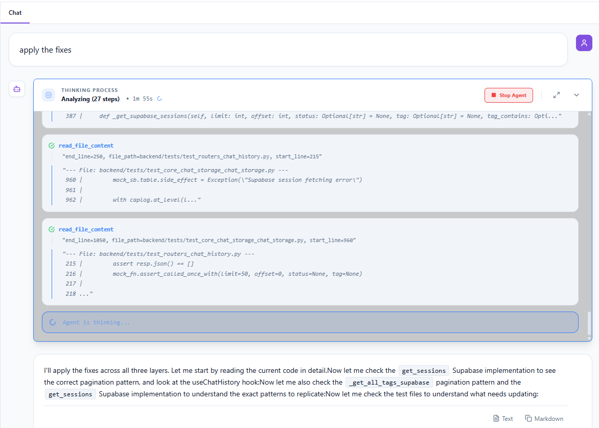 |
| **Deep Search Filters**   *Find specific contexts across your massive chat history.*  💡 **Pro-Tip:** [Click here for usage tips](chat_session_deep_search.md) | [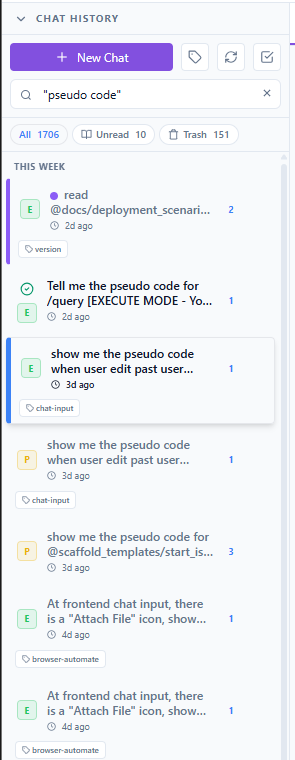](../pics/chat_history-deep_search_filter.png) |
| **Chat Session Action Menu**   *Change the chat session status and edit the title, tags, and color.* | 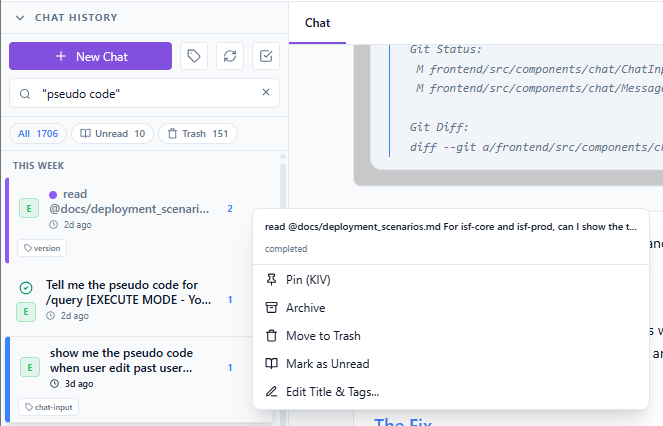 |
| **Multi-Select & Tagging**   *Organize chats with tags and bulk actions.* | 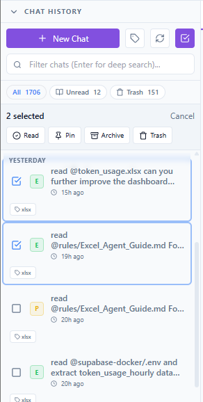    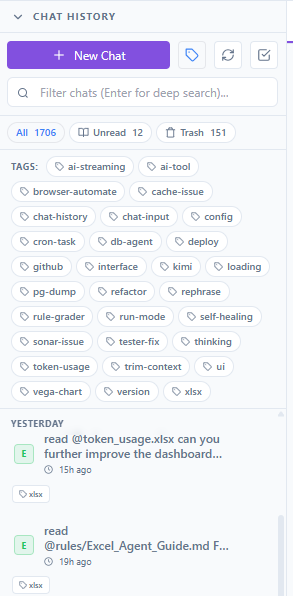 |

---

## 2. ⚡ Frictionless Input & Git Integration
Don't memorize commands. The UI provides deep intellisense for your files, commands, and Git operations.

| Feature | Preview |
|:---|:---|
| **`@` File Intellisense**   *Instantly link local files into the AI context without copy-pasting.* | 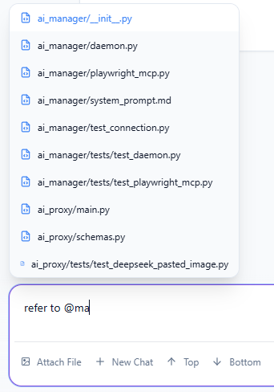 |
| **`/` Command Intellisense**   *Trigger workflows like Deep Research or Testing instantly.* | 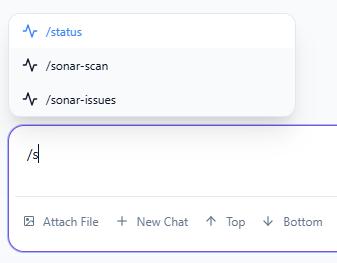 |
| **Git Commit Assistant**   *AI-generated commit messages based on precise git diffs.* | 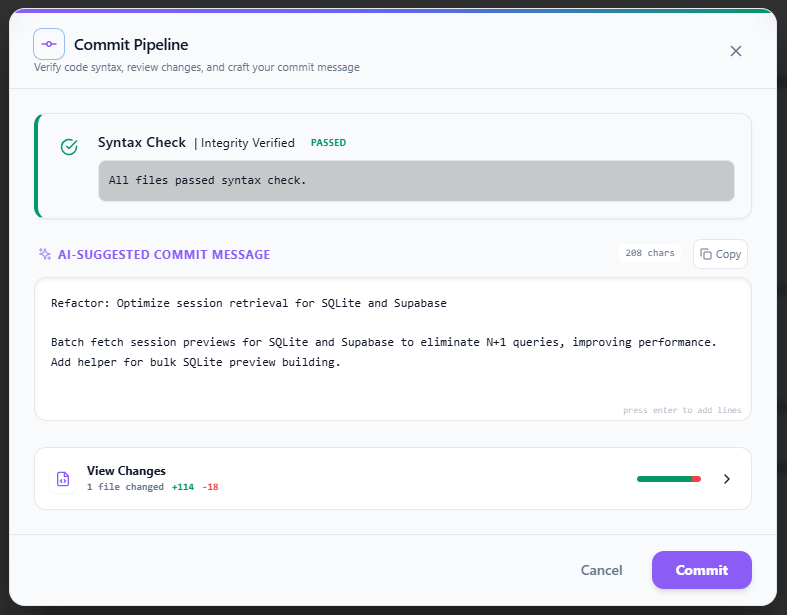 |

---

## 3. 📂 Workspace File & Project Management
Manage your local file system directly from the browser with powerful filtering and native editing.

| Feature | Preview |
|:---|:---|
| **Code Editor & Formatting**   *Built-in syntax highlighting and code formatting.* | 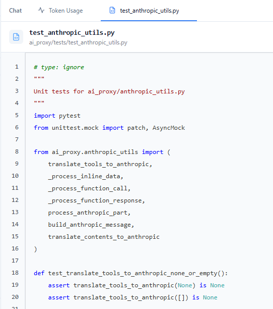 |
| **Project Explorer**   *Filter by modified files to instantly see what the AI changed.* | 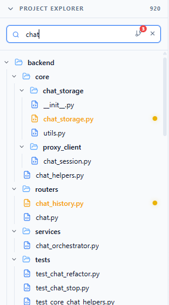    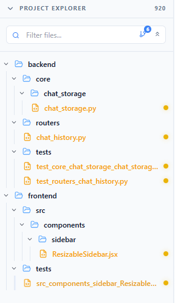 |

---

## 4. 📊 Federated AI Database Agent
Query your databases using natural English and instantly visualize the results.

| Feature | Preview |
|:---|:---|
| **Data Explorer**   *View rich datasets securely.* | 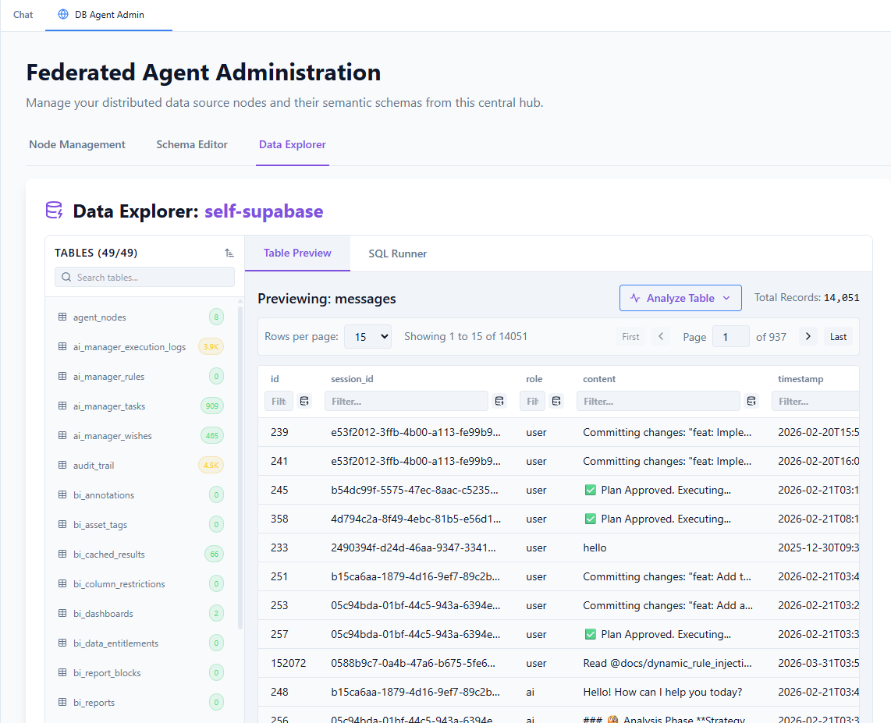 |
| **Node Management & Schemas**   *Manage federated nodes and edit database schemas visually.* | 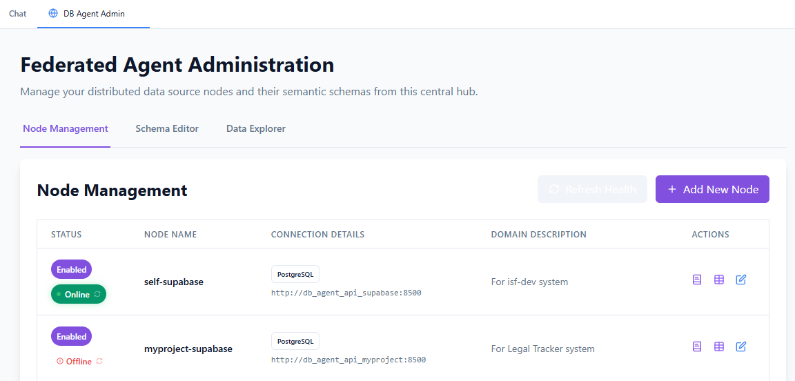    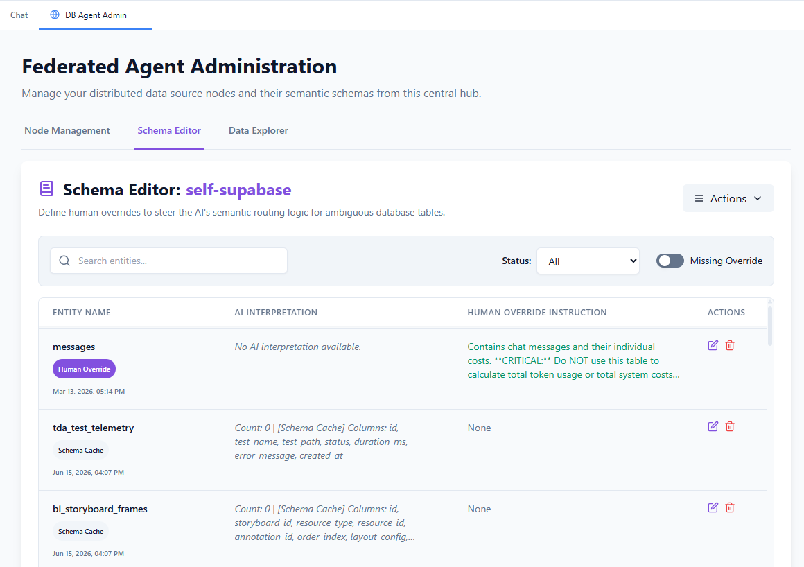 |

---

## 5. 📈 Usage Analytics & System Health
Maintain complete control over your LLM costs, cron jobs, and system guardrails.

| Feature | Preview |
|:---|:---|
| **Token Usage & Micro-Costs**   *Track usage by day or hour to prevent API bill surprises.* | 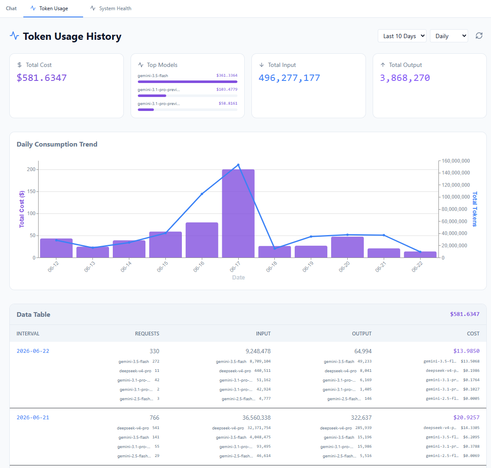    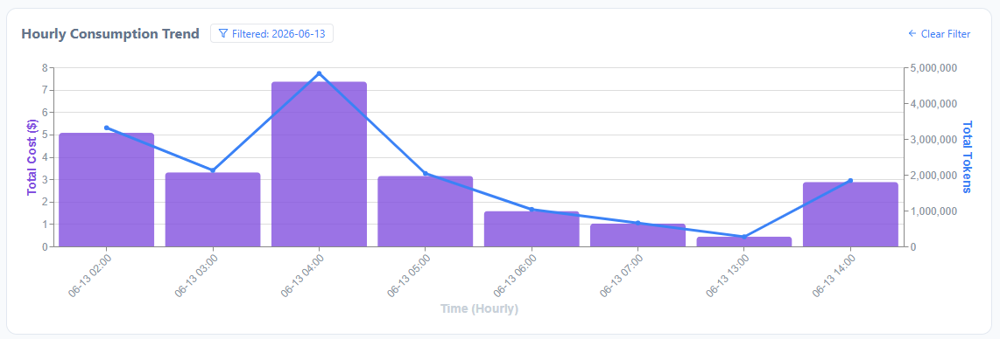 |
| **Cron Services Dashboard**   *Manage scheduled tasks like Sonar scans or test fixes.* | 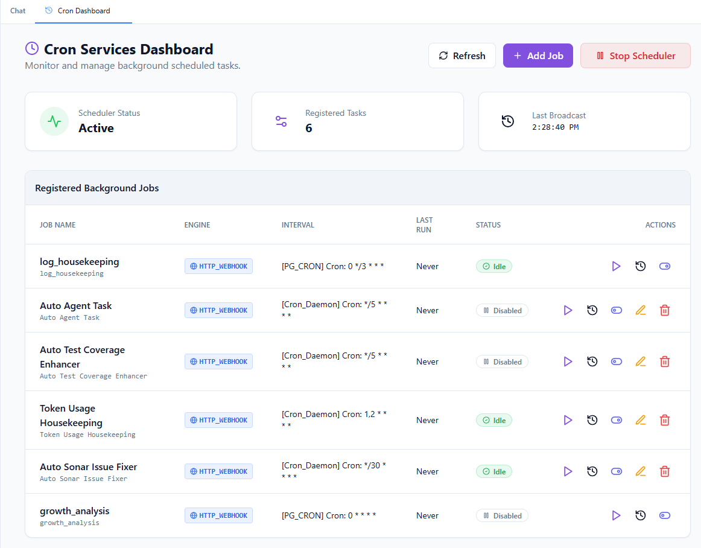 |
| **System & Rule Health**   *Monitor active modules and AI-generated operational rules.* | 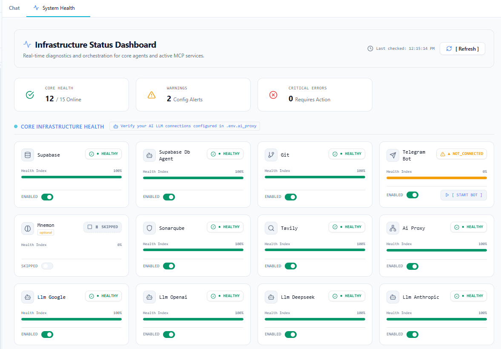    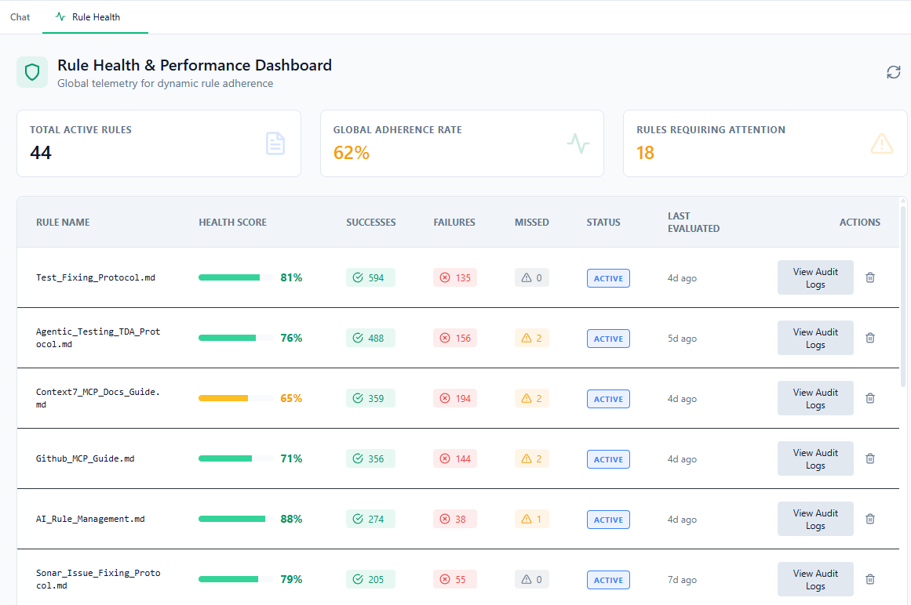 |

---

## 6. 🎨 Advanced Visualizations
| Feature | Preview |
|:---|:---|
| **Mermaid Sequence Diagrams**   *Render architectural diagrams directly in chat.* | 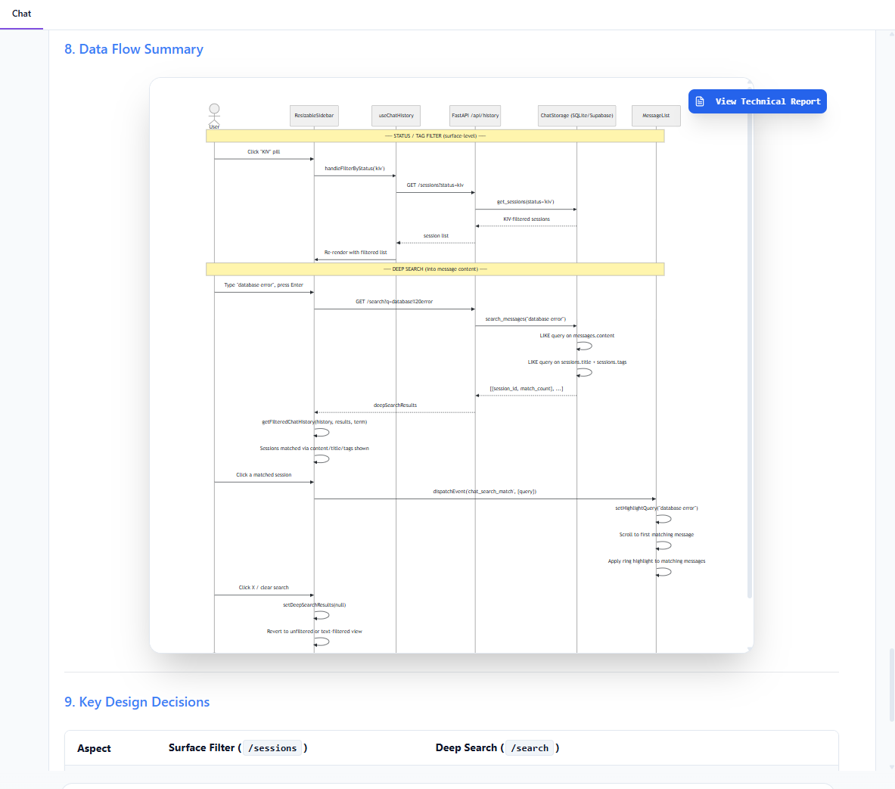 |
| **Appearance & Theming**   *Customize the workspace to your preference.* | 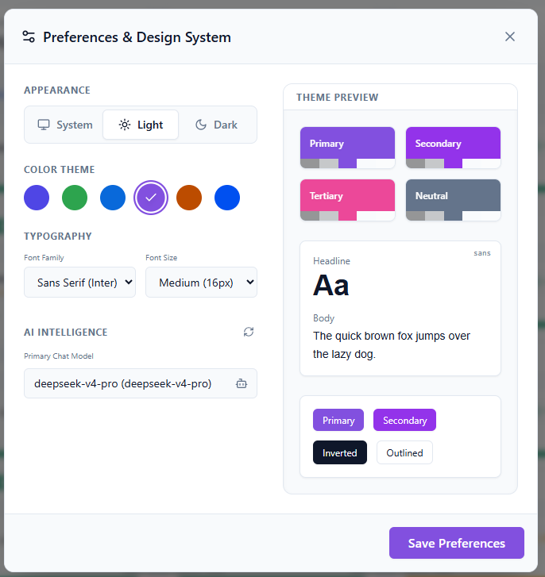 |
